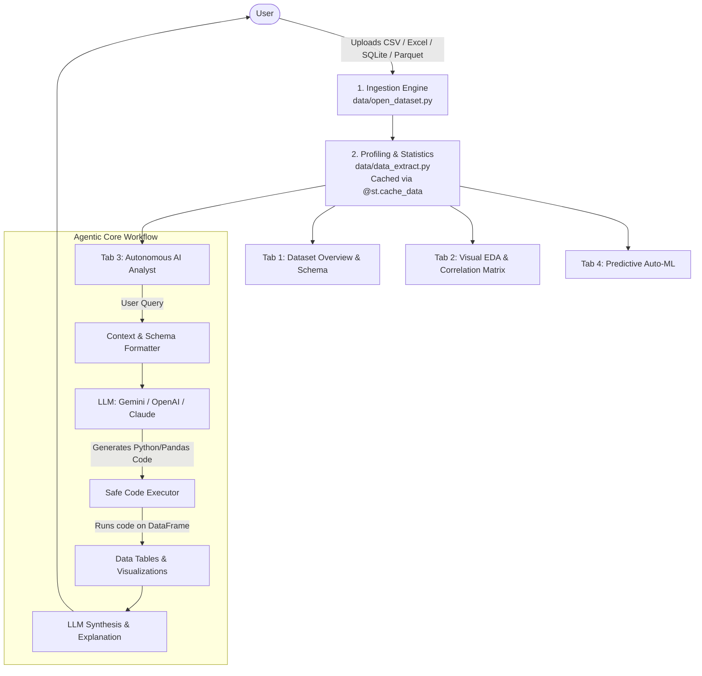

# 🤖 Agentic Data Analyst

An intelligent, autonomous data analysis assistant built with **Streamlit**, **Pandas**, **Scikit-Learn**, and **LLMs**. 

This application bridges the gap between raw business datasets and actionable decisions by combining traditional Exploratory Data Analysis (EDA) with an autonomous AI agent capable of answering natural language questions, generating charts on the fly, uncovering hidden anomalies, and building predictive models.

---

## 📌 Table of Contents
- [1. System Architecture](#1-system-architecture)
- [2. Current Project State](#2-current-project-state)
- [3. Master Implementation Roadmap](#3-master-implementation-roadmap)
  - [Phase 1: Bug Fixes & Performance Optimization](#phase-1-bug-fixes--performance-optimization)
  - [Phase 2: Comprehensive Exploratory Data Analysis (EDA) UI](#phase-2-comprehensive-exploratory-data-analysis-eda-ui)
  - [Phase 3: The "Agentic" Core (Natural Language Data Analyst)](#phase-3-the-agentic-core-natural-language-data-analyst)
  - [Phase 4: Autonomous Proactive Insights ("Auto-Analyst")](#phase-4-autonomous-proactive-insights-auto-analyst)
  - [Phase 5: Auto-ML & Predictive Intelligence](#phase-5-auto-ml--predictive-intelligence)
  - [Phase 6: Reporting & Export](#phase-6-reporting--export)
- [4. Recommended Folder Structure](#4-recommended-folder-structure)
- [5. How to Run Locally](#5-how-to-run-locally)

---

## 1. System Architecture



---

## 2. Current Project State

### What exists today:
- **Data Ingestion (`data/open_dataset.py`)**: Reads `.csv`, `.xlsx`, `.xls`, `.json`, and `.feather`.
- **Data Extraction (`data/data_extract.py`)**: Computes dataset shape, missing values, duplicates, numeric/categorical column separation, correlations, skewness, and kurtosis.
- **Streamlit Frontend (`app.py`)**: Prototype file uploader with single-column summary statistics.

### Immediate Issues to Resolve:
1. **File Uploader Extensions**: `st.file_uploader` has `type=["csv","excel","sql"]`. Streamlit requires exact extensions: `["csv", "xlsx", "xls", "json", "feather", "sqlite", "db"]`.
2. **SQLite BytesIO Bug**: `sqlite3.connect(file)` expects a file path string, not a Streamlit uploaded buffer.
3. **Streamlit UI Typos & Placeholders**: Leftover debug string `st.text("fwewejnwk")`, metric label `"Medium"` instead of `"Median"`, and unhandled multiselect values (`"nullvalues"`, `"sum"`).
4. **Performance & Caching**: Heavy statistical operations in `data_info()` run on every Streamlit rerun without caching.
5. **Missing LLM Integration**: The project currently lacks LLM reasoning, conversational capabilities, and tool calling.

---

## 3. Master Implementation Roadmap

### Phase 1: Bug Fixes & Performance Optimization
> **Objective**: Make the foundation rock-solid, fast, and bug-free before adding AI features.

- [ ] **Fix File Ingestion (`data/open_dataset.py`)**:
  - Add support for SQLite databases via temporary files:
    ```python
    import tempfile
    with tempfile.NamedTemporaryFile(delete=False, suffix=".db") as tmp:
        tmp.write(file.getvalue())
        tmp_path = tmp.name
    conn = sqlite3.connect(tmp_path)
    ```
  - Standardize error handling if a corrupted file is uploaded.
- [ ] **Clean Up `app.py`**:
  - Update `st.file_uploader`:
    ```python
    file = st.file_uploader(
        "Upload dataset",
        type=["csv", "xlsx", "xls", "json", "feather", "db", "sqlite"]
    )
    ```
  - Remove debug text `st.text("fwewejnwk")`.
  - Fix metric typos (`"Medium"` $\rightarrow$ `"Median"`).
- [ ] **Implement Streamlit Caching**:
  - Add `@st.cache_data` above `dataset_format(...)` and `data_info(...)` to eliminate lag on re-renders.

---

### Phase 2: Comprehensive Exploratory Data Analysis (EDA) UI
> **Objective**: Give users an intuitive, visual, and complete statistical breakdown of their data.

Convert `app.py` into a multi-tab interface:
```python
tab_overview, tab_viz, tab_agent, tab_ml = st.tabs([
    "📊 Data Overview", 
    "📈 Visual Exploration", 
    "🤖 AI Data Analyst", 
    "🔮 Predictive Modeling"
])
```

- [ ] **Tab 1: Data Overview**:
  - **KPI Cards**: Total Rows, Total Columns, Duplicate Rows, Missing Values (%), Memory Usage.
  - **Data Preview**: Interactive `st.dataframe(df.head(100), use_container_width=True)`.
  - **Column Data Dictionary**: Table showing each column's data type, non-null count, unique values, and sample values.
- [ ] **Tab 2: Visual Exploration**:
  - **Missing Values Chart**: Bar chart highlighting missingness per column.
  - **Correlation Heatmap**: Seaborn/Plotly heatmap for all numeric variables.
  - **Interactive Plot Builder**: Let users pick:
    - Chart Type: Histogram, Box Plot, Scatter Plot, Bar Chart, Line Plot.
    - X-axis & Y-axis selectors.
    - Group By (Hue / Category).

---

### Phase 3: The "Agentic" Core (Natural Language Data Analyst)
> **Objective**: Allow users to chat with their dataset using natural language to perform complex queries and generate charts autonomously.

- [ ] **Setup LLM Provider**:
  - Add your preferred LLM library (e.g. `google-genai` for Gemini or `openai` for OpenAI) to `pyproject.toml`.
  - Store API keys securely in a `.env` file and read them using `python-dotenv`.
- [ ] **Build the Context Formatter (`src/agent/prompt_builder.py`)**:
  - Prepare a concise data dictionary for the LLM containing:
    - Dataset shape
    - Column names and data types
    - Five sample rows (`df.head().to_dict()`)
    - Summary statistics
- [ ] **Build Safe Code Execution Engine (`src/agent/code_runner.py`)**:
  - The agent generates executable Python/Pandas code.
  - The execution engine executes the code in a sandboxed environment with access to `df`, `pd`, `np`, `plt`, and `sns`.
  - Captures textual outputs, tables, and generated `matplotlib`/`seaborn` figures.
- [ ] **Build Streamlit Chat Interface (`Tab 3`)**:
  - Implement chat using `st.chat_message` and `st.chat_input`.
  - Maintain conversation history in `st.session_state["messages"]`.
  - Render agent responses with:
    - Thought process / reasoning
    - Python code snippet executed (in an expandable accordion)
    - Resulting table or chart
    - Textual summary answering the user's question

---

### Phase 4: Autonomous Proactive Insights ("Auto-Analyst")
> **Objective**: Provide automated business insights with zero prompt engineering required from the user.

- [ ] **"Generate Executive Summary" Button**:
  - Feeds the statistical profile (`data_info`) directly to the LLM.
- [ ] **Automated Findings Sections**:
  - **Data Quality Audit**: Identifies severe outliers, columns with high missing rates, skewed distributions, and redundant identifiers.
  - **Key Business Drivers**: Highlights top correlated pairs and notable distribution shifts.
  - **Recommended Questions**: Suggests 3 to 5 high-value questions the user should ask the data next.

---

### Phase 5: Auto-ML & Predictive Intelligence
> **Objective**: Democratize predictive machine learning using Scikit-Learn without writing code.

- [ ] **Target Selection**:
  - User selects the column they want to predict.
  - System automatically infers problem type:
    - **Classification** (categorical or low-cardinality discrete target).
    - **Regression** (continuous numeric target).
- [ ] **Automated Preprocessing**:
  - Impute missing numeric values with median, categorical values with mode.
  - One-Hot Encode categorical features.
  - Train/Test Split (80/20).
- [ ] **Baseline Model Training**:
  - Classification: `RandomForestClassifier` or `HistGradientBoostingClassifier`.
  - Regression: `RandomForestRegressor` or `HistGradientBoostingRegressor`.
- [ ] **Model Evaluation Display**:
  - Classification: Accuracy, Precision, Recall, F1-Score, and Confusion Matrix.
  - Regression: $R^2$ Score, Mean Absolute Error (MAE), Root Mean Squared Error (RMSE).
  - **Feature Importance Plot**: Horizontal bar chart showing the top predictive drivers.

---

### Phase 6: Reporting & Export
> **Objective**: Enable users to export their findings into professional reports.

- [ ] **Clean Data Export**: Button to download the cleaned/processed dataset as a CSV.
- [ ] **Report Generator**: Compile key metrics, generated charts, and AI-written summaries into a downloadable Markdown or HTML report.

---

## 4. Recommended Folder Structure

Organize the repository for maintainability and modularity:

```text
Agentic_Data_Analyst/
├── data/
│   ├── __init__.py
│   ├── data_extract.py       # Statistical extraction & profiling
│   └── open_dataset.py       # Ingestion for CSV, Excel, SQLite, etc.
├── src/
│   ├── __init__.py
│   ├── agent/
│   │   ├── __init__.py
│   │   ├── code_runner.py    # Sandboxed execution of generated Python code
│   │   ├── llm_client.py     # Gemini / OpenAI API client setup
│   │   └── prompts.py        # System prompts & dataset context builder
│   ├── ml/
│   │   ├── __init__.py
│   │   └── auto_trainer.py   # Automated scikit-learn baseline trainer
│   └── ui/
│       ├── __init__.py
│       ├── tab_overview.py   # Overview & schema views
│       ├── tab_viz.py        # Charting & correlation heatmap
│       ├── tab_chat.py       # Agentic chat interface
│       └── tab_ml.py         # Model training & metrics
├── .env                      # API keys (GIT IGNORED)
├── .gitignore
├── app.py                    # Main Streamlit entry point
├── pyproject.toml
└── README.md
```

---

## 5. How to Run Locally

### Prerequisites
- Python 3.12+
- `uv` (recommended) or standard `pip`

### Installation
1. Clone the repository:
   ```bash
   git clone <repo-url>
   cd Agentic_Data_Analyst
   ```
2. Create and activate a virtual environment:
   ```bash
   uv venv
   .venv\Scripts\activate      # Windows
   # source .venv/bin/activate # macOS/Linux
   ```
3. Install dependencies:
   ```bash
   uv pip install -e .
   ```
4. Configure environment variables:
   Create a `.env` file in the root directory:
   ```env
   GEMINI_API_KEY=your_api_key_here
   # or OPENAI_API_KEY=your_api_key_here
   ```
5. Launch the application:
   ```bash
   streamlit run app.py
   ```
